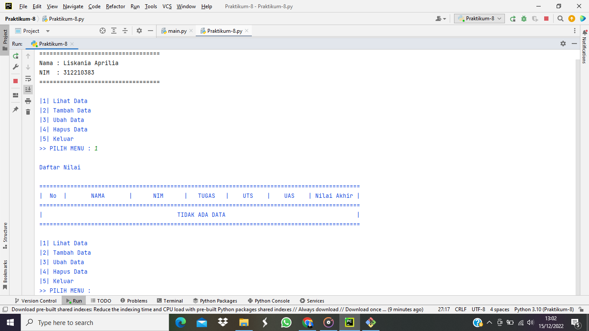
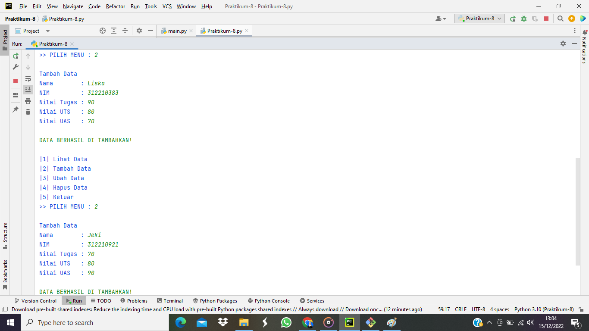
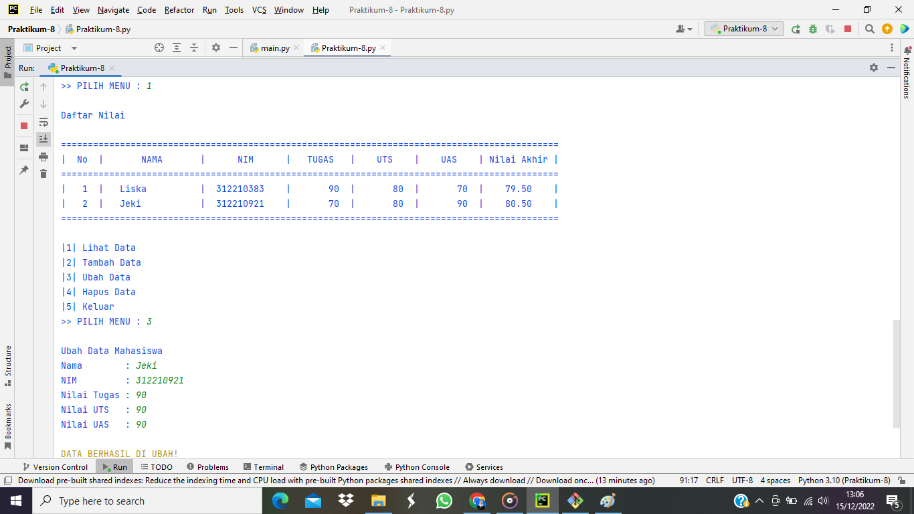
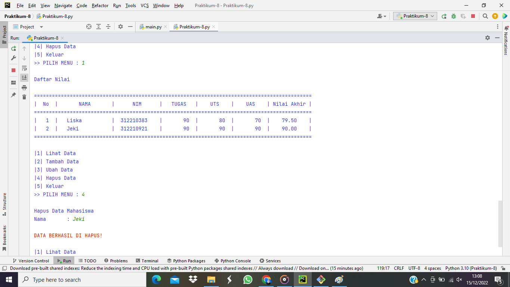
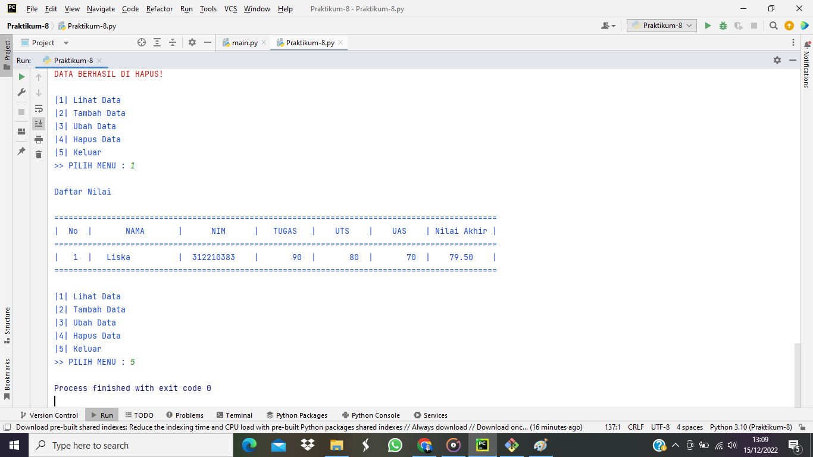

# Praktikum-8

# Tugas Praktikum 8
Buat program sederhana dengan mengaplikasikan penggunaan class. Buatlah class untuk menampilkan daftar nilai mahasiswa, dengan ketentuan:

1. Method tambah() untuk menambah data
2. Method tampilkan() untuk menampilkan data
3. Method hapus(nama) untuk menghapus data berdasarkan nama
4. Method ubah(nama) untuk mengubah data berdasarkan nama
5. Buat diagram class, flowchart dan penjelasan programnya pada README.md.
6. Commit dan push repository ke github.

# Penjelasan Program
1. Pertama kita harus mendeklarasikan bahwa variabel data sebagai penyimpanan (dictionary) sebuah data inputan

2. Selanjutnya adalah membuat Class 

3. Selanjutnya membuat constructor 
(Method atau fungsi yang akan dieksekusi ketika instance class dibuat).

4. Kemudian menambahkan definisi fungsi 

- Menggunakan Perulangan while True: dapat diartikan perulangan akan terus mengulang jika inputan benar dan masuk kedalam proses jika tidak maka perulangan berhenti atau lanjut ke proses selanjutnya. Gunakan statement if untuk memproses perintah yang diinginkan sesuai inputan.

5. Menambahkan Data

- Perintah dijalankan jika input yang dimasukan adalah '2', Kondisi berikut digunakan untuk melakukan input data seperti Nama, NIM, Nilai Tugas, UTS dan UAS :

- Untuk nilai akhir dibuat berdasarkan operasi dari variabel self.tugas, self.uts, self.uas yang mewakili Nilai Tugas, Nilai UTS, dan Nilai UAS.

6. Class Mahasiswa diturunkan dari Class data

- Menampilkan Data

- Perintah dijalankan jika input yang dimasukan adalah '1', Jika sebelumnya data sudah ditambahkan atau data tersedia, maka data tersebut akan ditampilkan sebanyak data yang ditambahkan. Jika data tersebut belum ditambahkan atau tidak tersedia, maka akan menampilkan bahwa tidak ada data :

- Data yang akan ditampilkan adalah Nama, NIM, Nilai Tugas, UTS, UAS, dan Nilai Akhir.

7. Mengubah Data

- Perintah dijalankan jika input yang dimasukan adalah '3', di dalam kondisi ini terdapat input dan kondisi, dimana jika ada di dalam variabel (data.keys) :

- Jika nama tersebut ada pada data, maka user akan diminta untuk menginputkan data apa saja yang ingin dirubah. Jika nama tersebut tidak ada, maka akan menampilkan bahwa data tidak ditemukan.

8. Menghapus Data

- Perintah dijalankan jika input yang digunakan adalah '4', sama seperti mengubah data, untuk menghapus data yang dipilih menggunakan variabel (data.keys):

- Jika nama tersebut ada pada data, maka data tersebut akan di-delete pada dictionary sehingga data tidak tersedia lagi. Jika nama tersebut tidak ada pada data, maka akan menampilkan bahwa data tidak ditemukan.

# Code Program
```python 
print("===================================")
print("Nama : Liskania Aprilia")
print("NIM  : 312210383")
print("===================================")

data = {}
class Data():
    def __init__(self, nama, nim, tugas, uts, uas, nilaiakhir):
        while True:

            print("\33[34m")
            print("|1| Lihat Data")
            print("|2| Tambah Data")
            print("|3| Ubah Data")
            print("|4| Hapus Data")
            print("|5| Keluar")

            x = input(">> PILIH MENU : ")

            if x == '1':
                self.tampilkan()
            elif x == '2':
                self.tambah()
            elif x == '3':
                self.ubah()
            elif x == '4':
                self.hapus()
            else:
                exit()

    def tambah(self):
        print()
        print("Tambah Data")
        self.nama = input("Nama        : ")
        self.nim = input("NIM         : ")
        self.tugas = int(input("Nilai Tugas : "))
        self.uts = int(input("Nilai UTS   : "))
        self.uas = int(input("Nilai UAS   : "))
        self.nilaiakhir = (self.tugas * 30 / 100) + (self.uts * 35 / 100) + (self.uas * 35 / 100)
        data[self.nama] = [self.nim, self.tugas, self.uts, self.uas, self.nilaiakhir]
        print("\33[32m\nDATA BERHASIL DI TAMBAHKAN!")

class mahasiswa(Data):

    def tampilkan(self):
        if data.items():
            print()
            print("Daftar Nilai")
            print()
            print("=============================================================================================")
            print("|  No  |       NAMA       |      NIM      |   TUGAS   |    UTS    |    UAS    | Nilai Akhir |")
            print("=============================================================================================")
            i = 0
            for a in data.items():
                i += 1
                print("|  {no:2d}  |   {0:12s}   |  {1:11s}  |  {2:7d}  |  {3:7d}  |  {4:7d}  |   {5:6.2f}    |"
                      .format(a[0][: 14], a[1][0], a[1][1], a[1][2], a[1][3], a[1][4], no=i))
            print("=============================================================================================")

        else:
            print()
            print("Daftar Nilai")
            print()
            print("=============================================================================================")
            print("|  No  |       NAMA       |      NIM      |   TUGAS   |    UTS    |    UAS    | Nilai Akhir |")
            print("=============================================================================================")
            print("|                                       TIDAK ADA DATA                                      |")
            print("=============================================================================================")

    def ubah(self):
        print()
        print("Ubah Data Mahasiswa")
        self.nama = input("Nama        : ")
        if self.nama in data.keys():
            self.nim = input("NIM         : ")
            self.tugas = int(input("Nilai Tugas : "))
            self.uts = int(input("Nilai UTS   : "))
            self.uas = int(input("Nilai UAS   : "))
            self.nilaiakhir = (self.tugas * 30 / 100) + (self.uts * 35 / 100) + (self.uas * 35 / 100)
            data[self.nama] = [self.nim, self.tugas, self.uts, self.uas, self.nilaiakhir]
            print("\33[33m\nDATA BERHASIL DI UBAH!")
        else:
            print("Data {0} tidak ada".format(self.nama))
            print("\33[31m\nDATA TIDAK DI TEMUKAN!")

    def hapus(self):
        print()
        print("Hapus Data Mahasiswa")
        self.nama = input("Nama       : ")
        if self.nama in data.keys():
            del data[self.nama]
            print("\33[31m\nDATA BERHASIL DI HAPUS!")
        else:
            print("Data {0} tidak ada".format(self.nama))
            print("\33[31m\nDATA TIDAK DI TEMUKAN!")

datamhs = mahasiswa("nama","nim","tugas","uts","uas","nilaiakhir")
```
# Hasil dari Program

- 

- 

- 

- 

- 
